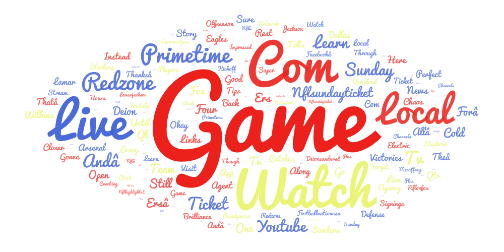
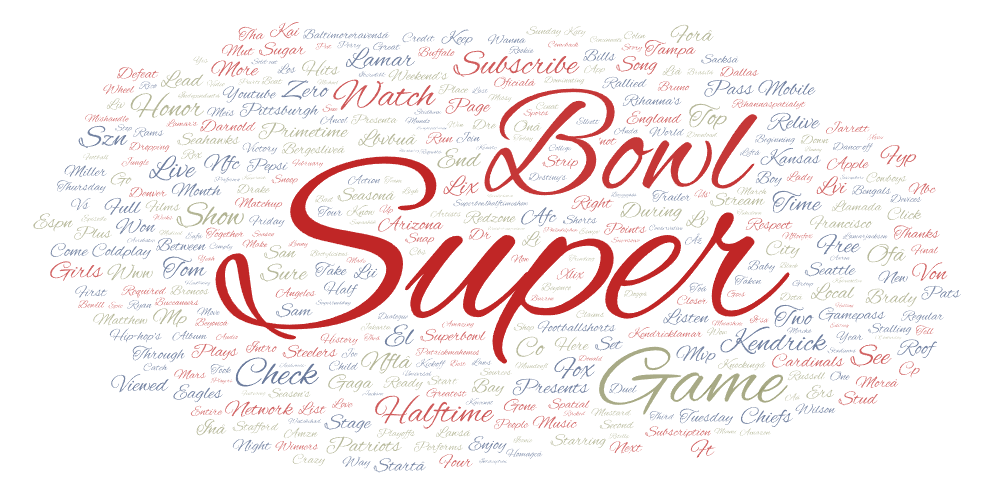

# GEOG 458 Lab 2 — Web Data Collection and Visualization
## YouTube Football Content Analysis

## Topic and Search Parameters
This project explores how football-related content is represented on YouTube through different search terms. The focus of this analysis is on professional American football and how language varies depending on the type of football content being searched.

Using the provided `youtube.ipynb` crawler, I collected YouTube search result data for the following football-related search terms:
- **NFL playoffs**
- **Super Bowl**
- **NFL highlights**

The crawler used Selenium and BeautifulSoup to simulate user interaction with YouTube search result pages. For each search term, the crawler scrolled through the results multiple times and extracted video metadata, including video titles, descriptions, view counts, and upload timing. The data collection was conducted in January 2026, and the **shortdesc** field from each dataset was used for textual analysis.

---

## Why This Comparison
I chose football as the topic because it has a large and diverse presence on YouTube, ranging from game coverage to commentary and entertainment. Although all three search terms relate to the same sport, they represent different ways audiences engage with football content.

I expected searches such as **NFL highlights** to focus more on viewing and replay content, while **Super Bowl** searches would emphasize the event itself, including cultural and entertainment elements. Comparing these search terms allows for an examination of how the same sport can be framed differently depending on user intent.

---

## Data Downloads
The collected datasets can be downloaded from the links below:
- [Download NFL playoffs data](./assets/NFL_playoffs.csv)
- [Download Super Bowl data](./assets/Super_Bowl.csv)
- [Download NFL highlights data](./assets/NFL_highlights.csv)

---

## Word Cloud Visualizations

### NFL Highlights

### Super Bowl

---

## Comparison of Word Clouds
The word clouds reveal clear differences in how football content is described across search terms. The **NFL highlights** word cloud is dominated by words such as “watch,” “live,” “game,” “redzone,” and “primetime.” These terms emphasize accessibility and media consumption, suggesting that highlight-related searches are primarily focused on viewing content and broadcast experiences.

In contrast, the **Super Bowl** word cloud contains a wider range of event-related and entertainment-focused terms. While “game” and “watch” remain prominent, additional words referencing halftime performances, teams, and cities appear more frequently. This indicates that Super Bowl content extends beyond the sport itself and reflects the event’s cultural and entertainment significance.

Overall, the comparison demonstrates that football content on YouTube is framed differently depending on the search context. NFL highlights emphasize ongoing sports consumption, while Super Bowl searches emphasize spectacle and large-scale cultural events.

---

## Possible Reasons for Observed Patterns
Several factors may explain these patterns. First, user intent strongly influences search results, as viewers searching for highlights are likely interested in quick access to game footage, while Super Bowl viewers engage with a broader set of narratives. Second, YouTube’s recommendation algorithms tend to amplify trending and popular topics, which can reinforce event-driven language for major games. Finally, the Super Bowl’s status as a cultural phenomenon attracts coverage from both sports and entertainment media, shaping the vocabulary used in video descriptions.

---

## Future Improvements
This research could be improved by collecting a larger volume of data through additional scrolling or repeated runs over multiple time periods. Further text cleaning could also be applied to remove generic YouTube-related terms. Additionally, expanding the analysis to include more search terms or comparing football content across different platforms could provide deeper insights into how sports narratives are shaped online.

---

## What Stood Out
One aspect that stood out was how distinct the Super Bowl word cloud appeared compared to the NFL highlights cloud, despite both being centered on football. I initially expected more overlap between the two, but the Super Bowl cloud included significantly more entertainment and event-related language. This highlights how the Super Bowl functions as a cultural event that extends beyond the sport itself.
